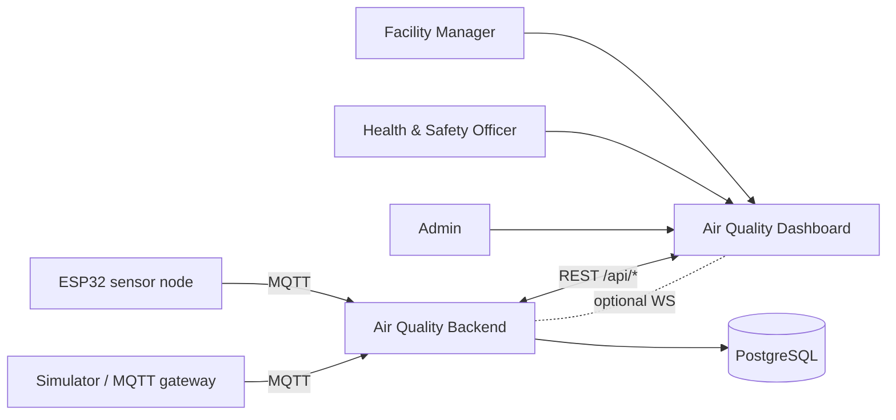
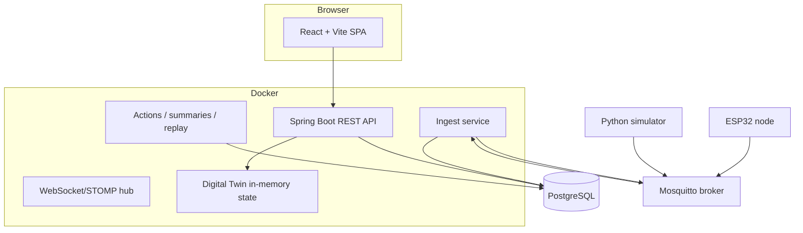
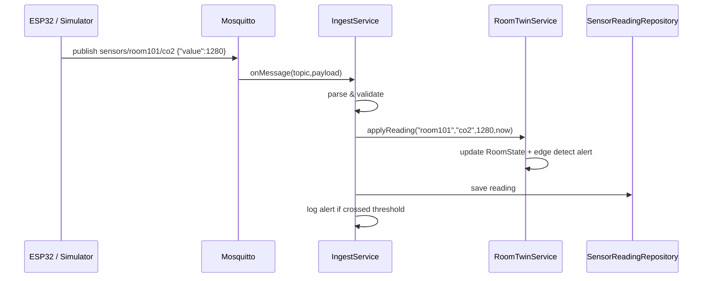
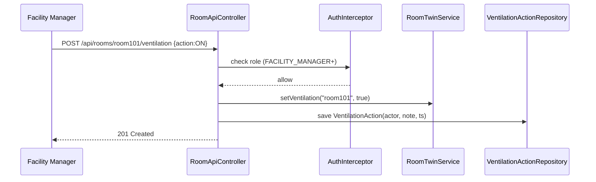

# 02 — Solution Design Pack

Architecture diagrams (C4), key sequence diagrams, the database schema, and a
threat model. Text-based C4 (Mermaid blocks) so it renders on GitHub.

---

## 1. Context Diagram (C4 L1)



## 2. Container Diagram (C4 L2)



## 3. Component Diagram: Backend (C4 L3)

```mermaid
flowchart TB
    subgraph api[api package — REST controllers]
        RoomApi[RoomApiController]
        Settings[SettingsApiController]
        Calib[CalibrationController]
        Summ[SummaryController]
        Replay[ReplaySimulationController]
        AuthC[AuthController]
    end
    AuthI[AuthInterceptor] -. guards /api/* .-> api
    subgraph twin[Twin layer]
        TwinSvc[RoomTwinService]
        RoomState[RoomState per room]
    end
    subgraph ingest[Ingest layer]
        Mqtt[ MqttSensorDataSource]
        SimFeed[SimulatorFeed]
    end
    subgraph domain[Domain / JPA entities + repos]
        Room, SensorReadingEntity, AlertEvent, VentilationAction,
        OccupancySnapshot, CalibrationProfile, DailyExposureSummary
    end

    api --> TwinSvc
    api --> domain
    TwinSvc --> RoomState
    Mqtt --> TwinSvc
    SimFeed --> Mqtt
    domain --> DB
    RoomApi --> RoomState
    Summ --> domain
    Replay --> domain
```

---

## 4. Key Sequence — Real-time State Update



## 5. Key Sequence — Human Action (Toggle Ventilation)



---

## 6. Database Schema (7 tables)

| Table | Purpose | Key columns |
|---|---|---|
| `room` | Static room catalogue | id, room_id, name |
| `sensor_readings` | Time-series readings | room_id, metric, value, unit, recorded_at; composite index `(room_id, metric, recorded_at)` |
| `alert_event` | Threshold crossings | room_id, metric, value, threshold, status, occurred_at |
| `ventilation_action` | Audit of on/off actions | room_id, action, actor, note, ts |
| `occupancy_snapshot` | Head-count changes | room_id, occupants, source, ts |
| `calibration_profile` | Sensor calibration history | room_id, metric, offset, scale, calibrated_by, notes, calibrated_at |
| `daily_exposure_summary` | Daily rollups | room_id, date, peak_co2, avg_co2, minutes_above, etc. |

> **Design decision (D1):** a plain PostgreSQL table (with the composite
> index) is used instead of a dedicated TSDB; justified in `DECISIONS.md`.

---

## 7. Threat Model (STRIDE, lite)

| Threat | Asset | Mitigation | Status |
|---|---|---|---|
| **Spoofing** — fake sensor injects bad data | Ingest | MQTT on localhost in dev; TLS+auth on broker for prod; malformed payloads dropped | Partial (local) |
| **Spoofing** — impersonate admin via API | Auth endpoints | Bearer tokens; role check on every `/api/*` (interceptor), login excluded | Done |
| **Tampering** — reading altered in transit | Readings | MQTT TLS (8883) in prod; local-only dev | Partial |
| **Repudiation** — "I never toggled ventilation" | Action log | Every action stores `actor` + timestamp (audit trail) | Done |
| **Information disclosure** — someone reads dashboards | All data | Role-based access (VIEWER/FM/ADMIN) | Done |
| **DoS** — malicious message flood | Ingest | Backpressure/logging; index on reads; no unbounded in-memory growth (per-room capped state) | Partial |
| **Elevation of privilege** — viewer becomes admin | Auth | Strict role hierarchy: ADMIN > FM > VIEWER; enforced per-endpoint | Done |
| **Credential leak** - default/plaintext | Datasource | Passwords via env vars (never committed); dev-only defaults | Done |

**Config note (D4):** `allow_anonymous true` only on the local dev broker.
Production production bullet list is in the Failure-Mode & Security doc.

---

## 8. Key Non-Functional Decisions

- **Concurrency:** a `ConcurrentHashMap<String,RoomState>` gives lock-free
  per-room state; `open-in-view=false` avoids lazy-loading pitfalls.
- **Deployability:** Docker multi-stage builds; compose for local stack.
- **Config:** environment variables with safe dev defaults (never secrets).
- **Time:** ISO-8601 UTC everywhere; simulator uses model-time acceleration.
